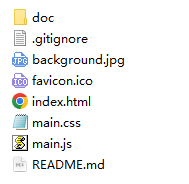
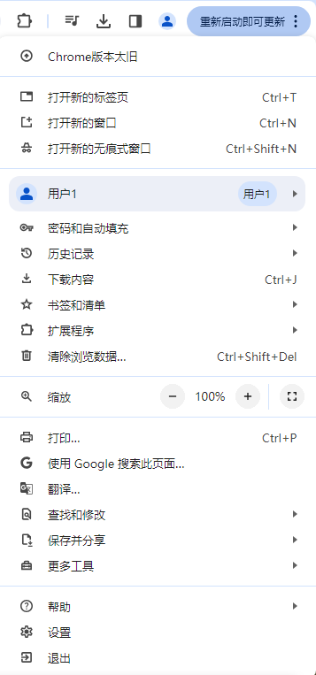
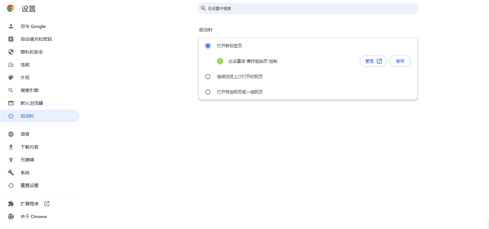
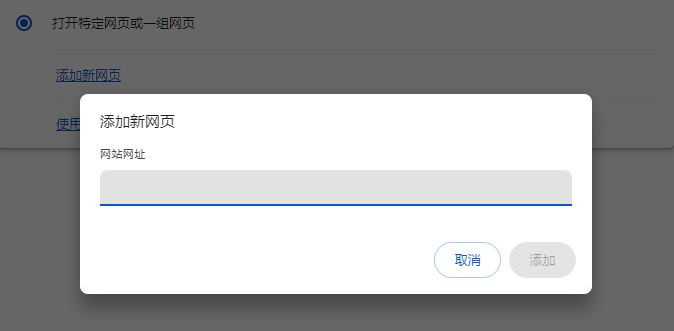
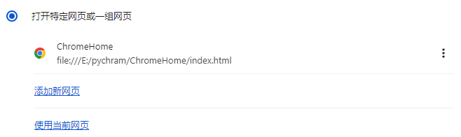
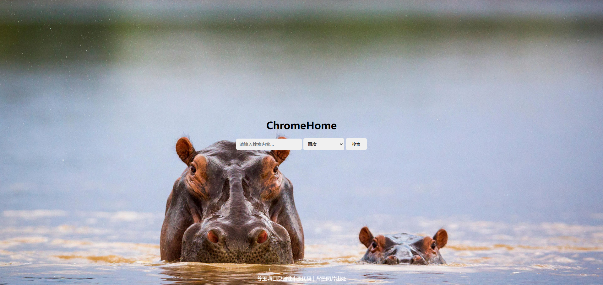
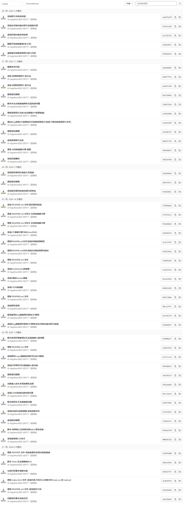

# ChromeHome 
## 项目介绍
ChromeHome 是一个浏览器的主页(HTML+CSS+JS)，一个纯前端的项目
## 项目使用场景
ChromeHome 这个项目适合使用于浏览器的主页
## 项目技术
> **纯前端项目**
HTML
CSS
JS
## 快速使用
第一步：下载项目
第二步：解压或者打开项目文件，打开后的文件如下（可能会随着更新有一些变动但是大体不会变）

第三步：打开浏览器（这里以 Google Chrome 为示范），点击 **右上角的个点**

第四步：点击 **设置**，然后接着点击 **启动时**

第五步：点击 **打开特定网页或一组网页** ，然后接着点击 **添加新网页**

第六步：输入自己下载项目中的 **index.html** 文件的**绝对路径**，然后点击 **添加 **， 完成效果如下

然后当打开浏览器的时候就会有 [**项目截图**](#项目截图) 的效果（注意：如果没有成功可能是被别的主页**篡改**了，或者是您的文件的**绝对路径**填写错误）
## 项目结构
```
/ -项目根目录
/doc -文档的资源存放处
/index.html -项目入口文件
/main.css -项目样式文件
/main.js -项目的JS代码
/README.md -项目介绍文件
/.gitignore -项目提交时忽略的文件
/favicon.ico -项目Logo[建议自行更换成自己喜欢的]
```
## 还原背景照片
如果需要原来的背景请取消掉**main.css**中的注释和删除**mian.js**中的代码
**main.css**修改前：
```css
/* background-image: url("background.jpg"); */
```
**main.css**修改后：
```css
background-image: url("background.jpg");
```
需要删除**mian.js**的代码如下：
```javascript
// 通过Bing背景API获取每日不同的背景照片
var myHeaders = new Headers();
myHeaders.append("User-Agent", "Apifox/1.0.0 (https://apifox.com)");
var requestOptions = {
    method: 'GET',
    headers: myHeaders,
    redirect: 'follow'
};
fetch("https://raw.onmicrosoft.cn/Bing-Wallpaper-Action/main/data/info.json", requestOptions)
    .then(response => response.text())
    .then(result => {
        try {
            var data = JSON.parse(result);
            var data_UHD_example = data.UHD_example;
            var backgroundLink = data_UHD_example;
            var bodyElement = document.body;
            bodyElement.style.backgroundImage = "url('" + backgroundLink + "')";
            bodyElement.style.backgroundSize = "cover";  //覆盖整个元素区域[可选]
            var link = document.getElementById("BingAPI_Url");
            link.href = data_UHD_example;
        } catch (error) {
            console.log('Invalid JSON', error);
        }
    })
    .catch(error => console.log('error', error));
```
## 项目截图

## 支持的搜索引擎

## 结尾
因为项目使用的是第三方GitLab平台，使用提交记录不公开！

**请尊重项目原创性，谢谢！**
